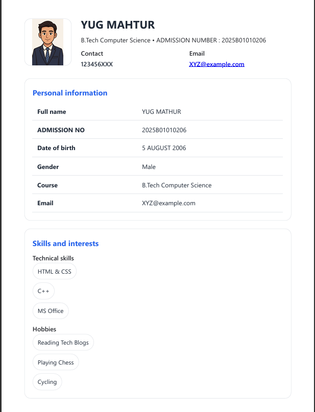

# Student Profile Card

A clean and responsive Student Profile Card website built using HTML and CSS.  
This project displays student details, profile image, contact information, and skills in a modern card layout.

---

## 🚀 Features

- Responsive design
- Modern profile card UI
- Personal information section
- Skills & interests section
- Clean and beginner-friendly code
- Lightweight project

---

## 🛠️ Technologies Used

- HTML5
- CSS3

---

## 📂 Folder Structure

```bash
├── index.html
├── style.css
├── img.jpeg
├── Preview_img.png
└── README.md
```

---

## 📸 Project Preview



---

## 🌐 Live Demo

https://yugmathur05.github.io/student-profile-card/

---
## 👨‍💻 Author

Yug Mathur
